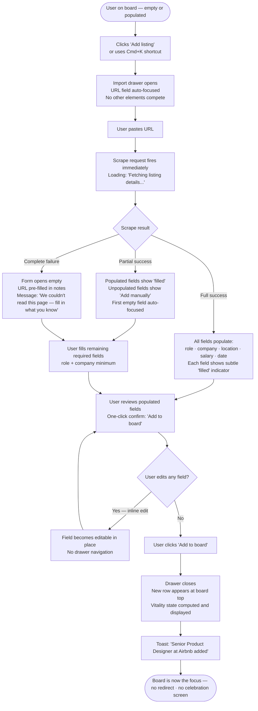
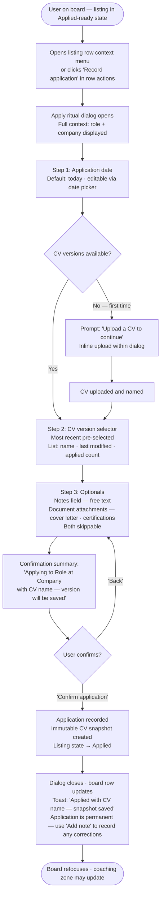
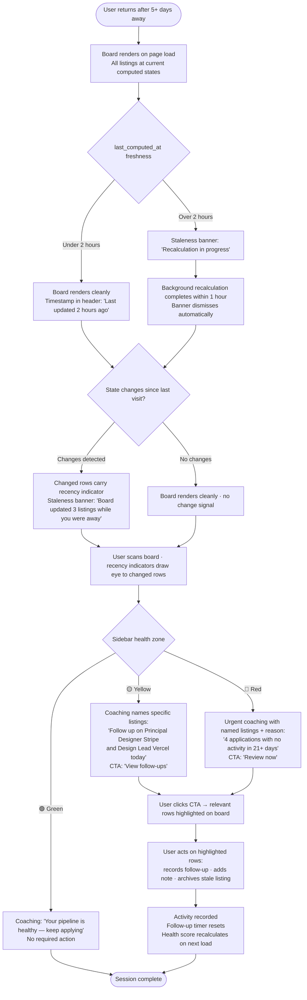
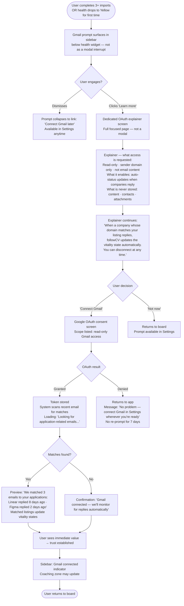
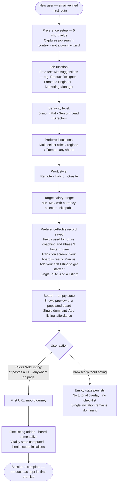

# UX Design Specification FollowCV

**Author:** Alex
**Date:** 2026-05-05

---

## Executive Summary

### Project Vision

FollowCV is a personal web application for the deliberate job hunter — a professional running 10–20 simultaneous applications who needs a system that holds up past week two. The product inverts the job tracker category: instead of a passive container users maintain, FollowCV is an active tracking system where the board self-diagnoses, the CV versions itself, and the health score gives one clear next action. The UX must embody this inversion — users should feel the product is working for them, not the other way around.

The core emotional job: not chaos management, but *restored sense of agency* in a process that is inherently outside the applicant's control. The board, the health score, and the CV snapshot exist to answer the questions that eat at people mid-campaign: "Am I missing something time-sensitive?", "What should I do next?", and "Which version did they see?"

### Target Users

**Primary — The Deliberate Job Hunter (Marcus archetype)**
- Senior IC, 30s, desktop-primary
- Running a structured search, not a panic search
- Technically comfortable but not managing applications like a project
- Will abandon within two sessions if the board requires active maintenance
- **Acquisition state:** optimistic, organised, giving the product two sessions to prove itself
- **Return state (week 2+):** potentially bruised, less patient; the board may have moved listings to Ghosting or Cold without his input — this person has different needs than Day One Marcus

**Secondary — Platform Admin (Alex archetype)**
- Product owner, Pro user, admin access
- Monitors scraper health, manages user accounts, handles GDPR exports
- The admin UX is a trust backstop for the product: silent scraper failure → wrong vitality data → Marcus abandons in session two without knowing why

### Key Design Challenges

1. **Vitality state visual system** — 8 states across 10–25 board rows must be scannable in under 10 seconds; colour alone insufficient (accessibility constraint); the system must also have a design stance for *bad news* — three rows shifting to Ghosting overnight is an emotional event, not just a display state change

2. **Prioritisation surface** — the board's primary cognitive job is collapsing decision space, not displaying information; "What should I do next on a specific application?" is the core question; the product-wide health score answers "how am I doing generally" but the per-listing triage question needs its own UX treatment

3. **Emotional arc of job hunting** — rejection, ghosting, and waiting are recurring states in the user's experience; the UX must have an explicit design stance on delivering bad news (Closed after interview, Ghosting after follow-up) that feels honest without being punishing; the board that self-maintains must feel like an ally, not an accuser

4. **Onboarding preference form as trust-building** — the moment Marcus decides whether the product understands him or is generic software; the questions asked, the language used, and the questions deliberately *not* asked determine whether he believes the health score coaching later; deserves its own UX treatment beyond form design

5. **Gmail OAuth as a consent and trust cliff** — asking a user to connect their inbox to a personal side-project is a significant trust request; not a settings toggle but a permission-granting ceremony requiring a dedicated UX pattern for earning the right to ask, communicating scope clearly, and reducing abandonment

6. **CV versioning abstraction** — snapshot-on-apply is a novel pattern for non-technical users; version selection and snapshot confirmation must feel natural; the snapshot-on-apply undo/correction flow ("I just applied and spotted a typo") must be designed, as it will occur in the first week of use

7. **Stale board return experience** — board state computes on page load; background recalculation runs within 1 hour; returning users need to understand what changed since their last visit; the `last_computed_at` timestamp and a light "what's new" signal are the minimum viable trust mechanism

8. **Empty state (first session)** — zero listings is the highest-churn moment in any productivity tool; the board-as-emotional-core promise collapses if the first impression is a blank page; this scenario needs its own design treatment

9. **Pro feature gate — consistent pattern** — every place a free user encounters a Pro feature (Gmail OAuth, CV Strength Meter, public profile) needs the same rendering decision: hidden, greyed-out, or upgrade-prompted; a single consistent pattern prevents ad-hoc gates across the UI and sets the tone for the freemium model

### Design Opportunities

1. **The board as emotional core** — the living board's visual language (state badges, staleness signals, urgency treatment) is the primary differentiator and the driver of the week-two retention moment: opening the app and seeing it has done its job without you

2. **Gmail OAuth as the primary return hook** — not just an auto-status-update feature but the mechanism that brings Marcus back when something real happens; the OAuth connection moment should be designed as the bridge from passive tracking to active engagement, not as a settings option buried in account preferences

3. **Coaching as ambient intelligence** — health score zone + single deterministic instruction is a rare UX pattern; done well it feels like a trusted advisor; the design challenge is keeping it present-but-ignorable when things are fine and unavoidable-but-not-alarming when action is needed

4. **The apply action as ritual** — recording an application is a meaningful moment; designed as intentional (not a form to fill) it reinforces user investment and makes the CV snapshot feel like a feature, not overhead

5. **The week-two word-of-mouth moment** — "what Marcus tells a friend after two weeks if it's working" is the product's north star for the UX; designing toward that story ("it just keeps track of everything, I don't have to do anything") shapes every micro-interaction decision

## Core User Experience

### Defining Experience

FollowCV's core experience is *passive-first*: the product's value is delivered through what it does without being asked. The user's most frequent interaction is reading the board, not updating it. This means every automated state change, every coaching prompt, and every CV snapshot that happens without input is the product keeping its central promise.

The critical interaction to get right is not the board — it's the URL import. This is the first five seconds where FollowCV either proves the premise ("paste a URL and it just works") or loses the user to their spreadsheet. Every other interaction builds on the trust established in that moment.

### Platform Strategy

**Primary platform:** Web application — desktop (1280px+), mouse and keyboard
**Secondary:** Tablet (768px+) — usable, not optimised
**Out of scope (MVP):** Mobile, offline mode, native app, touch-first interactions

**Rendering context:** Dashboard and job detail pages are client-side rendered (user-specific, behind auth). Landing page and public profile (Pro) are static/server-rendered. No real-time updates — board state reflects reality at page load; background recalculation runs within 1 hour of trigger and a `last_computed_at` signal surfaces freshness to the user.

**Input model:** Primary interactions are click and keyboard; no drag-and-drop, swipe, or gesture-based patterns in MVP. Form-heavy flows (import fallback, preference setup, apply action) must be keyboard-navigable and screen-reader compatible.

### Effortless Interactions

These interactions must require zero conscious effort — no decision, no confirmation, no friction:

- **Board reading** — scan all listings, vitality states, and priority signals in under 10 seconds; no interaction required to understand what needs attention
- **URL import** — paste a URL, watch fields populate; the only decision is "does this look right?"; the import result is the product's first proof point
- **CV snapshot on apply** — selecting a CV version and confirming the application automatically creates the snapshot; the user does not take a separate "save version" step
- **Health score coaching** — the next action instruction is always visible and actionable in one click; no navigation required to act on the recommendation
- **Board self-update on return** — opening the app after days away should feel like arriving at a desk where someone tidied while you were gone

### Critical Success Moments

**Moment 1 — The first import (< 5 seconds)**
Marcus pastes a URL. Title, company, location, salary, posting date populate. Vitality state computes. He didn't type a thing. This is the moment the product earns its premise. If this fails or feels slow, the session ends here.

**Moment 2 — The first return visit**
Marcus opens the app after 5+ days without logging in. Listings have moved states. One is now Deadline. Two are Cooling. The board has done its job while he was absent. This is the "I don't have to maintain this" realisation — the product's core retention event.

**Moment 3 — The first coaching action taken**
Health score drops to 🟡. The coaching instruction reads: "Two applications are overdue for follow-up — act today." Marcus follows up. Three days later one replies. Status updates to 💬 In Dialogue. Score returns to 🟢. The causal loop closes. This is when the product becomes trustworthy.

**Moment 4 — The empty board → first listing**
Before Moment 1, there is the blank board. Zero listings, nothing computed, no coaching. This is the highest-churn moment in any productivity tool. The empty state must make the path to Moment 1 feel immediately obvious and achievable — not a void, but an invitation.

**Moment 5 — The apply action with CV snapshot**
Marcus records his first application. He selects a CV version. The system confirms: "Applied with [CV name] — version saved." He now knows that six months from now, if asked "which version did you send?", he can answer. This is the quiet moment where CV versioning becomes personal, not technical.

**Moment 6 — Gmail OAuth granted**
Marcus connects his Gmail. From this point, status updates arrive without his input. This is the trust cliff that, once crossed, removes the last manual maintenance burden. The permission-granting ceremony must make him feel informed and in control, not surveilled.

### Experience Principles

**1. The board works while you sleep**
Every automated state change, every computed vitality transition, every health score recalculation is the product keeping its promise. The UX must make this automation *visible* and *trustworthy* — not hidden, not mysterious. Users should feel the product is on their side, not watching them.

**2. One clear thing, not everything**
At any moment, surface at most one priority action. The health score gives one coaching instruction. The board collapses decision space rather than expanding it. Follow-up items surface one at a time. When everything is urgent, nothing is. The product takes a position.

**3. Earn the right to deliver bad news**
Ghosting, Cold, Closed — these are honest state assessments with emotional weight. The product must earn the right to surface them by having proven its value first (Moments 1–2 above). Bad news delivery must be factual, not punishing; visible, not alarming. The design language for negative states must feel like a trusted friend reporting, not an algorithm judging.

**4. Transparency builds trust in automation**
Computed states must explain themselves. When was the board last updated? What triggered this state change? "Last updated 4 hours ago" is more reassuring than a board that silently changes. Mystery erodes trust faster than bad news. Every automated action should leave a visible trace.

**5. Friction only where it counts**
Irreversible or high-stakes actions — applying with a CV snapshot, archiving a listing, deleting an account — get intentional confirmation moments. Everything else is zero-resistance: browsing, reading, filtering, viewing CV history. The cost of confirmation must match the cost of the action.

## Desired Emotional Response

### Primary Emotional Goal: Calm Confidence

FollowCV's primary emotional target is **calm confidence** — the feeling that comes not from certainty about outcomes (which the product cannot provide) but from certainty about *process*. The user cannot control whether a company replies; they can control whether their application activity is complete, timely, and coherent. The product's job is to close that gap: to make the controllable feel genuinely under control, so the uncontrollable feels less threatening.

This is distinct from optimism, productivity satisfaction, or even relief. Calm confidence is a sustained state, not a moment. The design must earn it early (Moments 1 and 2) and maintain it across the emotional arc of a job search — including the rejection, ghosting, and silence that are statistically inevitable.

**Secondary: Restored Agency**
The core emotional job is reversed helplessness. Job hunting is structurally disempowering: applicants send applications into silence and wait. FollowCV's ambient intelligence — state transitions, follow-up prompts, health score coaching — should make the user feel like an active participant in their own search, not a passive petitioner. Every automated action the product takes should read as "your system is working" rather than "something changed without you."

### Emotional Journey Mapping

| Stage | Context | Target Emotion | Risk Emotion | Design Response |
|---|---|---|---|---|
| Discovery | First landing / referral | Curious, hopeful | Sceptical ("another tracker") | Lead with the premise, not the features: "paste a URL and it tracks itself" |
| Onboarding | Preference setup | Invested, understood | Generic / patronised | Questions must feel personal, not form-like; language matches a structured search, not a panic one |
| First import | URL paste → fields populate | Delight, validation | Disappointment (slow/incomplete) | Speed and completeness are the proof point; every populated field is a trust deposit |
| First return | Board has moved states | Relieved, impressed | Unsettled ("what changed?") | Change signal must be visible and explained; "updated while you were away" is reassuring, not alarming |
| Rejection / ghosting | State moves to Cold or Closed | Accepted, clear | Accused / judged | Factual language, forward framing; the product reports, it doesn't editorialize |
| Follow-up prompt | Health score drops to 🟡 | Capable, prompted | Nagged / pressured | One clear action, not a list; the instruction is an invitation, not a warning |
| Application milestone | Apply action with CV snapshot | Proud, organised | Burdened (more admin) | The moment should feel like a ritual, not a form; confirmation copy matters |
| Week two return | Board self-maintained, search ongoing | Trusted ally, sustained | Abandoned / forgotten | The board doing its job is the retention event; Marcus should feel the product has been working for him |

### Emotional Tensions to Design For

**Trust vs. Scepticism** *(most critical)*
The user arrives sceptical — they've tried spreadsheets, they've bounced off generic trackers. Every interaction in the first session either adds to or depletes a trust balance. URL import is the largest single deposit; a slow or incomplete import is the largest single withdrawal. The emotional design must treat trust as a finite resource being actively managed, not assumed.

*Design implication:* Explain what the product just did and why. "Title and company populated from the listing" is more reassuring than silent field population. Automation without explanation reads as magic — magic becomes suspicious when it fails.

**Agency vs. Helplessness**
The self-maintaining board is the product's core value — but it risks making the user feel passive, not empowered. The framing must be "your system is active" not "things happened to your board." Automated state changes should feel like the product reporting to the user, not operating independently of them.

*Design implication:* Passive-voice automation descriptions ("Moved to Cooling") should be replaced with active constructions ("3 listings moved to Cooling — no activity in 14 days"). The user is always the subject; the board is their instrument.

**Clarity vs. Overwhelm**
10–20 active applications is intentionally the target scale. This is a cognitive load problem: the board must collapse, not expand, the decision space. The health score's single-instruction model is the primary mechanism; the board's vitality system is the secondary. Neither can leak complexity.

*Design implication:* Information hierarchy on the board must be ruthlessly maintained. The most urgent thing is always the most visible thing. Filter states and secondary data (salary, location) are available but subordinate.

**Honesty vs. False Comfort**
Ghosting is real. Rejection is real. A product that softens these states into "pending" or hides Closed listings is doing the user a disservice — and eroding trust when reality becomes undeniable. The product must be honest about hard states while not making them the emotional centre of the experience.

*Design implication:* Negative states (Ghosting, Cold, Closed) are presented factually, in neutral colour and language, with a forward-facing action available where one exists. The board's focus is always the active pipeline; archived states are accessible but not prominent.

**Pride vs. Embarrassment**
Recording an application is an intentional, meaningful act. The apply action should feel like a confident move, not form-filling. The CV snapshot confirmation is the moment where the product reinforces that the user is running a professional, organised search — not fumbling through ad-hoc applications.

*Design implication:* Apply action confirmation copy should be affirmative and specific: "Applied to [Role] at [Company] with [CV name] — version saved." Not "Application recorded."

### Emotional Design Principles

**1. Coach, don't grade**
The health score is a coaching instrument, not a performance evaluation. Language, colour, and iconography must signal "here's what to do" not "here's how you're doing." The distinction is in the direction of address: coaching faces forward, grading faces backward.

**2. Honest without dwelling**
Negative states are reported once, clearly, then made available rather than prominent. The product does not repeat bad news or keep it in the visual foreground. A listing that moves to Ghosting gets the appropriate state badge; it doesn't generate ongoing notifications or appear in coaching prompts unless an action is available.

**3. Quiet competence**
The board's self-maintenance should feel like a trusted colleague who tidied the desk, not a system sending notifications. State changes are visible on return; they're not announced mid-session. The product's work is seen, not heard.

**4. Earned trust made explicit**
The product should occasionally surface its own track record: "Updated 3 listings while you were away" on return, "7-day follow-up window triggered for 2 applications" in the coaching zone. These micro-confirmations are the evidence that the product is doing its job — and they compound trust over time.

**5. Agency amplifier**
Every automated action is framed as the user's system acting on their behalf, not the product acting independently. "Your follow-up window triggered" not "Follow-up overdue." The user's search, the user's board, the user's next move — the product is the instrument, not the agent.

## UX Pattern Analysis & Inspiration

### Inspiring Products Analysis

**Airbnb** *(Marcus's reference — visual quality, responsiveness)*
Information-dense cards that don't feel dense. Each card communicates 6–8 data points (price, location, rating, photos, dates, availability) at a glance without cognitive load — through hierarchy, whitespace, and thumbnail imagery. Functional immediately; value is visible before you commit. Filters are contextual, not page-changing. Key lesson: high information density achieved through *visual* rather than *textual* communication. Status, urgency, and action are read from shape and colour before text is processed.

**Linear** *(issue tracker — gold standard for status-based productivity)*
Status systems that feel fast and scannable. Keyboard-first without abandoning mouse users. State badges are the primary communication layer. Inline editing: click status → change it, no modal. Command palette for power users without cluttering the surface for casual users. Sub-second feel even with large datasets. Key lesson: inline state changes without modals are the gold standard for boards.

**Monzo / Revolut** *(financial dashboards — making lists scannable)*
Transaction lists that are 30+ items long but feel scannable. Merchant logos, amounts, and categories form a visual rhythm. Grouping by date breaks monotony. Status communication through iconography, not colour alone (accessibility). Micro-copy that's factual but human. Key lesson: lists of 10–25 items become scannable when each row has a visual anchor, rows are grouped by a meaningful dimension, and the most important data point is typographically dominant.

**Things 3 / Todoist (free tier)** *(lightweight task management)*
Does one thing, does it perfectly. Zero feature weight visible to the user — complexity is hidden behind progressive disclosure. Empty states feel like invitations, not voids. Key lesson: restraint is a design decision. Features the user doesn't need today shouldn't occupy visual space. The "add item" affordance is always the most prominent UI element.

**Stripe Dashboard** *(status badges, empty states, data tables)*
Data tables that aren't data tables — each row reads like a sentence. Status badges communicate before text is read. Best-in-class empty states: each shows a preview of what the populated state looks like, reducing uncertainty. Key lesson: empty states are marketing, not error handling. Show the user what success looks like from day zero.

### Transferable UX Patterns

**Navigation Patterns**
- **Persistent sidebar with status summary** (Linear) — a left rail showing active listing count, health score zone, and one coaching prompt provides constant orientation without requiring navigation. Applied to: FollowCV dashboard chrome.
- **Contextual filter chips above the board** (Airbnb) — filter by vitality state or last activity without a separate filter page or drawer. Applied to: board filtering UX.

**Interaction Patterns**
- **Inline status editing** (Linear) — clicking a vitality badge opens a compact dropdown to manually override state; no modal, no page change. Applied to: manual state override on the board.
- **Keyboard-accessible quick actions** (Linear command palette, simplified) — `Cmd+K` shortcut for the 3 most common actions (add listing, record application, connect Gmail) without breaking board reading flow. Applied to: power user path.
- **Toast confirmation, not modal confirmation** (Things 3) — low-stakes actions (archiving, adding a note) confirm via a dismissable toast. Only the apply action and account deletion use an intentional confirmation moment. Applied to: all board actions except the apply ritual.

**Visual Patterns**
- **Card rows with visual anchors** (Airbnb) — company favicon as the visual anchor per row; humans process images before text. Applied to: board rows (favicon from scraped URL as default).
- **Status badge system with icon + label** (Monzo) — each vitality state is a coloured pill with icon + label; no state communicates through colour alone. Applied to: full 8-state vitality badge system.
- **Row grouping by status** (Monzo) — board rows optionally grouped by vitality bucket (Deadline, Active, Cooling, Cold, Archive) to create visual rhythm for 15–25 row boards. Applied to: board default sort/group as a toggle.

### Anti-Patterns to Avoid

- **Modal forms for quick actions** — any action that can be inline (status change, adding a note, marking a follow-up done) must be inline; modals interrupt flow and Marcus will abandon them
- **Long flat lists without visual anchors** — a text-only list of 20 company names is a spreadsheet; the board earns its status as an upgrade through visual scannability
- **Feature-forward empty states** — showing a feature list or onboarding checklist when the board is empty signals complexity before value; show the board as it will look, with a single "Add your first listing" affordance
- **Notification overload** — the product's value is *not* being in the user's face; the board self-maintains, it doesn't nag; email notifications and in-app banners are opt-in and minimal
- **Settings-buried primary features** — Gmail OAuth is a return hook, not a settings option; CV versioning is core, not a CV section; feature placement must match feature importance

### Design Inspiration Strategy

**What to Adopt**
- Airbnb's card hierarchy: visual anchor (logo) + dominant metric (role/company) + secondary info (status, date) — same visual grammar for board rows
- Linear's inline state editing: click badge → change it — no modal for status overrides
- Things 3's restraint principle: only features the user needs today are visible today; Pro features are present but not prominent
- Stripe's empty state approach: show what a populated board looks like; make "add first listing" the single dominant affordance

**What to Adapt**
- Monzo's transaction grouping → adapt for vitality grouping: group by urgency tier (Deadline / Active / Cooling / Cold / Archive) as a view toggle, not by date
- Linear's command palette → simplify to `Cmd+K` shortcut for the 3 most common actions; no full palette complexity
- Airbnb's filter chips → adapt for vitality states: chips above the board for each of the 8 states, multi-select, instantly reactive without page reload

**What to Avoid**
- Linear's complexity ceiling: FollowCV has 6 primary actions; import no metaphors that imply depth Marcus doesn't need
- Airbnb's photo-driven visual weight: board rows use favicons, not photos; the hierarchy must work at favicon scale
- Monzo's 30-row list tolerance: financial apps tolerate long lists because users scroll for a specific item; FollowCV's board is scanned top-to-bottom in one pass — 25 rows is the comfort ceiling; archiving should be encouraged above that threshold

## Design System Foundation

### Design System Choice

**shadcn/ui + Tailwind CSS v4**, built on Radix UI primitives.

This is a themeable system in the copy-paste model: components live in the codebase (not in `node_modules`) and are modified directly. It is not a dependency to override — it is a starting point to own.

### Rationale for Selection

**Component ownership.** shadcn/ui components are copied into the project and modified freely. FollowCV's custom patterns — the VitalityBadge system, inline state editing, the apply ritual — require component-level control that dependency-based design systems resist. Owning the components removes that friction entirely.

**Accessibility via Radix UI.** Every shadcn/ui component is built on Radix UI primitives, which handle keyboard navigation, ARIA attributes, focus trapping, and screen reader compatibility by default. The preference setup form and apply action flow (both flagged as must-be-keyboard-navigable in the platform spec) get compliant behaviour for free.

**Airbnb aesthetic fit.** The clean, whitespace-heavy, typographically precise visual target maps naturally to Tailwind utility classes. There are no shadow opinions about colour or spacing to undo — the design tokens are defined once and the components defer to them.

**Next.js App Router compatibility.** shadcn/ui is the de facto component standard in the Next.js ecosystem. Server component compatibility, streaming, and the App Router model are first-class concerns in its design.

**Against alternatives:**
- *Ant Design / Material UI defaults* — carry enterprise or Google visual opinions that conflict with the Airbnb-adjacent aesthetic; significant override cost for a solo build
- *Custom design system* — unjustified investment for a solo project where the differentiator is product behaviour, not visual brand identity
- *Mantine* — comprehensive and capable, but heavier and less aligned with the Next.js App Router model

### Implementation Approach

**Base component set** (install only what's used):
`Button`, `Input`, `Badge`, `Card`, `DropdownMenu`, `Toast`, `Command`, `Dialog`, `Select`, `Separator`, `Tooltip`

**Custom components to build** on top of the base:
- `VitalityBadge` — 8-state badge with icon + label + colour token; no state communicates through colour alone
- `HealthScoreWidget` — coaching zone display with score, zone indicator (🟢/🟡/🔴), and single instruction
- `BoardRow` — listing card row with favicon anchor, role/company, vitality badge, date, and inline action affordance
- `ApplyRitualDialog` — the intentional confirmation moment for the apply action; the one modal in the product
- `ProGatePattern` — consistent rendering for free-tier users encountering Pro features (greyed + upgrade prompt)
- `StalenessBanner` — lightweight "updated while you were away" signal on board return

**Icon library:** Lucide React (ships with shadcn/ui; consistent stroke weight; accessible by default)

### Customisation Strategy

**Colour tokens — vitality state system** (defined in `globals.css` as CSS custom properties):
- Hot: amber-500 (urgent attention, time-sensitive)
- Active: emerald-500 (healthy, in progress)
- Cooling: sky-400 (passively monitored)
- Cold: slate-400 (low activity, low urgency)
- Deadline: orange-500 (time-critical, distinct from Hot)
- Ghosting: purple-400 (neutral report, not alarming)
- In Dialogue: blue-500 (positive engagement)
- Closed: neutral-400 (archived, not prominent)

All colour tokens meet WCAG AA contrast requirements against the white/off-white board background. Each badge additionally carries an icon to satisfy the accessibility requirement that no state communicates through colour alone.

**Typography:** Inter — open-source equivalent of Airbnb's typeface. Clean, professional, excellent legibility at 13–14px board-row sizes. Loaded via `next/font`.

**Border radius:** 0.75rem card radius (slightly softer than shadcn/ui default of 0.5rem), matching Airbnb's card aesthetic.

**Spacing grid:** 4px base (Tailwind default `space-1` = 4px). Board row height: 56px. Sidebar width: 256px. Content max-width: 1200px.

## Defining Core Experience

### Defining Experience

FollowCV's defining experience, in one sentence: **"You paste a URL. The board tracks itself."**

That is the product's word-of-mouth story, its retention hook, and the single promise the entire UX must keep. The URL import is the moment the product earns its premise — every other feature either supports it or is irrelevant without it.

The second defining experience — the first return after several days away — is the retention event. Marcus opens the app and sees the board has moved. Listings he hasn't touched have new states. The board has been working while he wasn't. This is the "I don't have to maintain this" realisation that converts a trial user into a returning one.

Both experiences share the same UX quality: **the user's role is reviewer, not operator.**

### User Mental Model

**What Marcus brings to the first session:**
Marcus's existing solution is a spreadsheet (or Notion table, or bookmarks list). His mental model for job tracking is manual: add a row, fill in columns, update status when something changes. He is used to the tracker being a passive container he maintains.

| From (spreadsheet model) | To (FollowCV model) |
|---|---|
| I add rows and fill columns | I paste URLs and review what populated |
| I update status when I get news | The board updates; I confirm or override |
| I remember to follow up | The coaching zone prompts me once |
| I don't know which CV version I sent | I select a version at apply time; it's immutable |
| I check the spreadsheet when I remember | I return because the board knows things I don't |

**Where users get confused:**
- "Why didn't the URL populate correctly?" — scraper failure is the single highest-trust-cost event; graceful degradation to manual entry (without making the failure prominent) is required
- "Did that state change automatically or did I do that?" — provenance of state changes must be visible; "Computed from activity" vs. "You changed this" is a meaningful distinction
- "Is this information current?" — the `last_computed_at` staleness signal addresses this; it must be passive enough not to raise anxiety when the board is fresh

### Success Criteria

**URL Import (Moment 1):**
- Fields populate within 3 seconds of URL submission for successful scrapes (p95 target)
- Minimum populated fields: role title + company name; partial population is a success with clear labelling of what populated vs. what needs manual entry
- Vitality state computed and displayed before the user closes the import confirmation
- Confirmation requires a single click ("Looks good — add to board"); no multi-step form for a successful import
- Import fallback (failed scrape) presents a pre-filled form with whatever was captured, focused on the first empty required field

**Board Self-Update (Moment 2):**
- State changes since last visit are visually distinguishable on return — a subtle recency indicator on recently-changed rows
- A `last_computed_at` timestamp is visible on the board on load — not in settings, not in a tooltip
- State change provenance is accessible (one click) but not surfaced by default

**Apply Action (Moment 5):**
- CV version selection to confirmation in 3 steps maximum (select CV → review → confirm)
- Confirmation copy names the role, company, and CV version explicitly
- Snapshot created silently after confirmation; no additional step

### Novel vs. Established Patterns

**Established (familiar, low education cost):**
- URL paste → content population — familiar from Slack/Notion/Twitter link previews
- Status badge system — familiar from Linear, GitHub, Jira
- Filter chips — familiar from Airbnb, LinkedIn, Google Maps
- Toast confirmations — ubiquitous; no education required

**Novel (require careful introduction):**
- **Passive-first board management** — no productivity tool has trained Marcus that the board updates without his input; the first return visit (Moment 2) is the education event, not an onboarding screen; seeing it happen once builds the trust that a hundred onboarding slides wouldn't
- **CV snapshot-on-apply** — immutable version capture at apply time is not a known pattern outside developer tooling; the metaphor must be "a photograph taken the moment you sent it", not "a version control commit"
- **Computed health score with deterministic coaching** — the score's value is that it gives one and only one instruction; the first time health drops to 🟡 and produces a specific, actionable prompt, the user must see the causal relationship or it reads as arbitrary

**Teaching without onboarding:**
The URL import teaches the passive model by doing it. The first return teaches self-maintenance by showing the board changed. The first 🟡 score teaches the coaching model by giving a real instruction on a real application. The product teaches itself through normal use — no feature tours, no checklists.

### Experience Mechanics

**URL Import — step by step:**

1. **Initiation:** "Add listing" button in the top-right (and as the dominant empty-state CTA). Click → compact import drawer opens (not a full-page modal).
2. **Input:** Single URL field, auto-focused. Paste triggers immediate scrape request — no submit button needed; paste = initiate. Loading state: skeleton field rows (label + input shapes) inside a subtle bordered card, announced via `role="status"` / `aria-live="polite"`. No spinner.
3. **Population:** Fields appear as data resolves — role, company, location, salary, posting date. Populated fields carry a subtle "filled" visual state. Fields that couldn't be populated are visually distinct and labelled "Add manually."
4. **Review:** User scans populated fields. One click confirms ("Add to board"); any field is inline-editable before confirming. No required fields beyond role + company.
5. **Completion:** Drawer closes. New listing appears at the top of the board with its computed vitality state. Toast: "[Role] at [Company] added." Board is now the focus — no redirect, no celebration screen.

**Stale Board Return — step by step:**

1. **Load:** Board renders at page load with all listings at their current computed states. `last_computed_at` timestamp in the board header ("Last updated 2 hours ago").
2. **Change signal:** Listings whose state changed since the user's last visit carry a subtle recency indicator (dot or muted "Updated" label, visible for 48 hours after change).
3. **Staleness acknowledgement:** If `last_computed_at` is more than 2 hours old, a light banner: "Board last updated [time] — recalculation in progress." Disappears when recalculation completes. No user action required.
4. **Return to work:** Health score and coaching zone reflect current state. If anything needs attention, it's immediately visible. If nothing does, the board is quiet — no notifications, no banners, no prompts.

## Visual Design Foundation

### Color System

**Design philosophy:** The vitality state badge system is the dominant colour communication layer. Every other colour is subordinate — the brand palette is intentionally quiet so the 8-state system reads clearly against it.

**Base palette:**

| Token | Tailwind | Hex | Role |
|---|---|---|---|
| `--background` | white | `#FFFFFF` | Page and board background |
| `--surface` | slate-50 | `#F8FAFC` | Sidebar, panels, drawer backgrounds |
| `--border` | slate-200 | `#E2E8F0` | Dividers, card borders, row separators |
| `--text-primary` | slate-900 | `#0F172A` | Headings, board row primary info |
| `--text-secondary` | slate-600 | `#475569` | Board row secondary info, labels |
| `--text-tertiary` | slate-400 | `#94A3B8` | Timestamps, placeholders, disabled |
| `--brand` | indigo-600 | `#4F46E5` | Primary buttons, links, focus rings |
| `--brand-hover` | indigo-700 | `#4338CA` | Button hover state |
| `--brand-subtle` | indigo-50 | `#EEF2FF` | Selected row background, active filter chip |

**Semantic status colours:**

| Token | Tailwind | Hex | Role |
|---|---|---|---|
| `--success` | emerald-600 | `#059669` | Health score 🟢, positive states |
| `--warning` | amber-500 | `#F59E0B` | Health score 🟡, attention prompts |
| `--danger` | red-500 | `#EF4444` | Health score 🔴, destructive actions |
| `--info` | sky-500 | `#0EA5E9` | Informational banners, tooltips |

**Vitality state badge system:**

| State | Background / Text | Icon (Lucide) |
|---|---|---|
| Hot | `amber-100` / `amber-700` | `Flame` |
| Deadline | `orange-100` / `orange-700` | `Clock` |
| Active | `emerald-100` / `emerald-700` | `CircleCheck` |
| In Dialogue | `blue-100` / `blue-700` | `MessageCircle` |
| Cooling | `sky-100` / `sky-600` | `Thermometer` |
| Cold | `slate-100` / `slate-600` | `Snowflake` |
| Ghosting | `purple-100` / `purple-600` | `Ghost` |
| Closed | `neutral-100` / `neutral-500` | `XCircle` |

All badge combinations meet WCAG AA (4.5:1) on white. Each badge carries icon + label — no state communicates through colour alone.

**Interactive states:**

Every actionable element — buttons, sidebar links, back-to-board pills, drawer close, footer sign-out — must visibly respond on hover. Static-looking buttons (a sign-out that doesn't tint, a nav link with no rail) read as broken. Treatments:

- **Board rows (hover):** `slate-50` background
- **Sidebar nav links:** idle `text-secondary` on transparent → hover `bg-brand-subtle/60` + `text-brand`; active route gets full `bg-brand-subtle` + `text-brand` and a 2px left rail in `--brand`. Transition `colors 150ms ease-out`. Active state set via `aria-current="page"`.
- **Primary buttons (`brand` variant):** `bg-brand` → hover `bg-brand-hover` + `shadow-sm`; active translates 1px down (`active:translate-y-px`).
- **Outline buttons:** `bg-background` border → hover `bg-muted` + slightly darker border + `shadow-sm`.
- **Ghost buttons (sidebar sign-out, drawer close, in-row ghost actions):** transparent → hover `bg-brand-subtle` + `text-brand`. Used wherever a button needs to feel low-stakes but never silent.
- **Inline text actions ("Enter manually", "Try a different URL"):** `text-secondary`/`text-brand` → hover gains underline + `text-brand`.
- **Focus ring:** `--brand` at 2px offset (`focus-visible:ring-2 focus-visible:ring-brand/40`), meets 3:1 focus indicator contrast.
- **Disabled:** 50% opacity, `pointer-events-none` (no hover state shown).

All hover transitions use `duration-150 ease-out` — fast enough to feel direct, slow enough to register.

### Brand Mark

The FollowCV identity is a logo-mark + wordmark pair, intentionally minimal:

- **Mark:** 32×32 rounded square (`rx=8`) in `--brand` indigo. Inside it, a stylised "F" rendered as three white strokes (vertical stem + two ascending rungs) plus a small white dot in the lower-right quadrant. The dot reads as a signal/recency accent — it ties the mark to the product's recency-dot pattern on the board.
- **Wordmark:** "Follow" in `--text-primary`, "CV" in `--brand`. Inter, semibold, tight tracking. The colour split lets the mark and wordmark share a single accent without doubling visual weight.
- **Sizes:** `sm` (22px mark, `text-base`) for inline use; `md` (28px mark, `text-lg`) for the dashboard sidebar; `lg` (40px mark, `text-2xl`) for the login screen.
- **Surfaces:** Sidebar (md, with wordmark) and login (lg, with wordmark, centred). Favicon and any future external surface (OG image, marketing) will use the mark only.
- **Implementation:** [src/components/shared/Logo.tsx](../../followcv/src/components/shared/Logo.tsx). Inline SVG — no external asset, no font dependency for the mark, scales without rasterisation.
- **Accessibility:** Mark carries `role="img"` + `aria-label="FollowCV logo"`; wordmark text remains real text for screen readers and search.

Why a mark at all: the previous treatment was wordmark-only at `text-base` weight 600, which read as plain UI text rather than identity. The mark gives the sidebar a visual anchor point and earns the small footprint of vertical space at the top of the rail.

### Typography System

**Typeface:** Inter, loaded via `next/font/google`. Single typeface — Inter's weight range (100–900) provides all hierarchy without a secondary font.

**Type scale:**

| Name | Size | Line height | Weight | Use |
|---|---|---|---|---|
| `text-2xl` | 24px | 32px | 700 | Health score number |
| `text-xl` | 20px | 28px | 600 | Page titles, section headings |
| `text-lg` | 18px | 28px | 600 | Coaching instruction text |
| `text-base` | 16px | 24px | 400 | Body copy, drawer content |
| `text-sm` | 14px | 20px | 400–500 | Board row primary info (role, company) |
| `text-xs` | 12px | 16px | 400 | Timestamps, badge labels, secondary info |

**Hierarchy rules:**
- Board rows use two sizes only: `text-sm` for role/company, `text-xs` for date/salary. Clean scan rhythm, no visual noise.
- Health score number (`text-2xl`, 700) is the single largest element in the dashboard — its prominence is earned.
- Coaching instruction (`text-lg`, 600) is the second-largest prose element — it must be read before the user scans the board.
- Minimum text size: 14px for functional content; 12px only for non-critical secondary labels.

### Spacing & Layout Foundation

**Base unit:** 4px. All spacing is a multiple of 4px.

**Key measurements:**

| Element | Value | Rationale |
|---|---|---|
| Sidebar width | 256px | Standard for left-nav productivity apps; fits health + coaching widget |
| Board row height | 56px | Dense enough for 20 rows; comfortable scan target |
| Content max-width | 1200px | Comfortable on 1280px primary target |
| Import drawer width | 480px | Lightweight feel while fitting all populated fields |
| Card border radius | 12px (0.75rem) | Softer than shadcn default; matches Airbnb card aesthetic |
| Badge border radius | 9999px | Pills, not chips — reinforces read-only identity |

**Layout zones:**

```
┌──────────────────────────────────────────────────┐
│  Top Nav (56px): logo + user menu                │
├──────────────┬───────────────────────────────────┤
│  Sidebar     │  Board area (flex-grow)           │
│  (256px)     │                                   │
│              │  Filter chips row (40px)          │
│  Health      │  ─────────────────────────        │
│  Score       │  Board rows (56px each)           │
│  Widget      │                                   │
│              │                                   │
│  Coaching    │                                   │
│  Instruction │                                   │
│              │                                   │
│  Nav links   │                                   │
└──────────────┴───────────────────────────────────┘
```

**Spacing conventions:**
- Between board rows: 1px border (list, not grid)
- Sidebar internal padding: 16px horizontal
- Board row internal padding: 16px horizontal, 0 vertical (height is fixed)
- Between filter chips: 8px (`gap-2`)
- Section heading to content: 16px (`space-y-4`)

### Accessibility Considerations

**Colour contrast:** All text/background pairings meet WCAG AA minimum. Vitality badge combinations verified against both `white` and `slate-50` backgrounds. `--text-tertiary` (slate-400) used only where size or context provides redundancy.

**Keyboard navigation:** Tab order follows visual reading order (sidebar → filter chips → board rows → row actions). Every interactive element is keyboard-reachable. `Cmd+K` is additive — no interaction is keyboard-only.

**Focus management:**
- Import drawer: focus → URL field on open; returns to "Add listing" button on close
- Apply ritual dialog: focus trapped within dialog; returns to board row on close
- Inline state editing: focus → dropdown on badge click; returns to badge on selection or Escape

**Screen reader:**
- Vitality badges: `aria-label` includes state name + context ("Hot — urgent follow-up needed")
- Board rows: rendered as `<ul>/<li>` with appropriate landmark roles
- Health score: announced as "Application health: Green — [coaching instruction]"
- `last_computed_at`: rendered as `<time>` element with ISO datetime attribute

## Design Direction Decision

### Design Directions Explored

Six directions were prototyped and evaluated against the project's core requirements (board scannability, health score prominence, passive-first experience, Airbnb aesthetic target):

| Direction | Layout | Verdict |
|---|---|---|
| A · Classic Sidebar | Sidebar left + board main | **Selected** |
| B · Top Rail | Full-width board, health inline in nav | Health too compressed; coaching loses prominence |
| C · Health Forward | Full-width amber coaching banner | Feels alarming even when health is green; conflicts with quiet competence principle |
| D · Split Detail | Narrow list + right detail panel | Adds navigation complexity for a secondary use case |
| E · Card Grid | Airbnb-style 3-column cards | Poor scannability at 20+ listings; insufficient data density per card |
| F · Ultra-Minimal | Bare 48px header, no sidebar | Health score too hidden; loses trust-building weight; one coaching pattern adopted |

### Chosen Direction

**Direction A — Classic Sidebar**, with one element adopted from Direction F.

The persistent left sidebar (256px) holds the health score widget, coaching instruction, and navigation links. The board occupies the remaining 1024px at 1280px viewport width.

**Element adopted from Direction F:** The coaching instruction names specific listings ("Follow up on Principal Designer (Stripe) and Design Lead (Vercel) today") rather than an anonymous count ("2 applications overdue"). Specificity is the difference between ambient intelligence and generic prompting — the sidebar widget must surface listing names, not just numbers.

### Design Rationale

**Health score demands persistent real estate.** The score and coaching instruction are FollowCV's primary differentiator. Compressing them into a nav slot (Direction B) or a conditional banner (Direction C) reduces their weight precisely when they matter most. The sidebar gives both elements room to breathe and establishes a consistent reading order on every visit: health score → coaching instruction → board scan.

**The sidebar establishes a reading hierarchy.** Users arrive at the dashboard and scan left-to-right. The sidebar delivers the "how am I doing and what should I do?" answer before the board delivers the "what is the state of each application?" answer. This sequence mirrors the coaching model: global before granular, action before information.

**Familiarity reduces friction.** The sidebar-plus-main-content layout is the dominant pattern in productivity tools (Linear, Notion, Figma, GitHub). Marcus already understands it without onboarding. The novel elements (vitality badges, passive board, coaching zone) can occupy his learning budget; the layout shell should not.

**Directions E and F fail at target scale.** The card grid (E) sacrifices scannability above 12 listings — the product targets 10–25. The ultra-minimal layout (F) hides the health score at a cost: if Marcus can't find the coaching instruction, the central retention loop breaks.

### Implementation Approach

**Component mapping to chosen direction:**
- Sidebar shell: `<aside>` with `w-64` fixed width, `bg-slate-50`, `border-r`
- Health score widget: `HealthScoreWidget` custom component, pinned to top of sidebar
- Coaching instruction: rendered within `HealthScoreWidget`, naming specific listings
- Navigation links: `NavLink` component with active state via `usePathname()`
- Board area: `<main>` with `flex-1 overflow-y-auto`
- Board row: `BoardRow` custom component, `h-14` (56px), `border-b`
- Staleness banner: `StalenessBanner` custom component, renders conditionally above filter bar on return visit

**Responsive behaviour (tablet 768px+):**
The sidebar collapses to icon-only at 768–1024px; health score widget moves to a compact top-nav chip (borrowing Direction B's pattern at smaller viewports). The full sidebar is restored at 1280px+.

## User Journey Flows

### Journey 1 — First URL Import

The defining experience. Five seconds where the product earns or loses its premise.



**Flow optimisations:**
- Paste = initiate (no submit button): removes one conscious step
- Partial scrape is not a failure state — it's a prompt; the form is partially pre-filled, not empty
- Cancel is always available; closing the drawer discards without confirmation (no data written yet)
- Failure messaging uses "we couldn't read this page" (system responsibility), not "invalid URL" (user blame)

---

### Journey 2 — Apply Action with CV Snapshot

The intentional ritual. The one modal in the product. Three steps maximum.



**Flow optimisations:**
- Three steps maximum: date → CV → optionals; confirmation is a summary, not a step
- Application is permanent once confirmed — use "Add note" on the listing to record post-apply corrections; this keeps the snapshot record honest
- CV upload is inline within the dialog — no navigation break on first use
- "Confirm application" copy is directional, not bureaucratic ("Submit")

---

### Journey 3 — Returning User / Board Self-Update

The retention event. Marcus opens the app after days away and sees the board has done its job.



**Flow optimisations:**
- Recency indicator is passive (visible, not announced); rewards scanning, not reacting
- Coaching names specific listings, not anonymous counts
- 🔴 coaching gives a reason, not just a count; users need to understand why the score dropped to trust the system
- "View follow-ups" highlights relevant rows on the board — no navigation to a separate page

---

### Journey 4 — Gmail OAuth Connection

The trust cliff. A consent ceremony, not a settings toggle.



**Flow optimisations:**
- OAuth prompt surfaces only after the board has proven its value (3+ imports) — the product earns the right to ask before asking
- Explainer is a dedicated screen because the trust stakes justify the space
- Scope explanation leads with what is *not* accessed (email content) before what is
- OAuth denial is a soft landing with no immediate re-prompt
- Immediate email matching on connection closes the trust loop before second-guessing

---

### Journey 5 — Preference Setup / Onboarding

Trust-building first session. The moment Marcus decides whether FollowCV understands him.



**Flow optimisations:**
- Five fields, deliberately short; labels use plain language ("Where do you want to work?"), not product jargon ("location preferences")
- Salary range is the only skippable field; all others take under 5 seconds each; if user exits mid-flow, completed fields are saved and defaults applied for the rest
- Transition screen uses first name — personal, not generic
- Empty state shows a preview board (greyed placeholder listings) so the user knows what they're building toward

---

### Journey Patterns

**Navigation patterns:**
- **Drawer** — URL import; non-blocking, focused, dismissable without confirmation
- **Ritual dialog** — apply action only; the one full modal; focus-trapped, intentional
- **Dedicated page** — Gmail OAuth explainer; trust stakes justify full-page treatment
- **Inline** — all state overrides, note additions, field edits; no drawer or modal

**Decision patterns:**
- Every flow has a non-punishing exit path that does not require explanation
- Irreversible actions get a confirmation step; reversible actions get toast-with-undo
- System failures are soft landings that preserve partial work and offer a forward path

**Feedback patterns:**
- **Toast** — successful action confirmation; bottom-right; dismisses after 5 seconds; carries timed undo where relevant
- **Staleness banner** — system-level state; appears above filter bar; dismisses automatically; never requires user action
- **Recency indicator** — passive per-row signal; visible 48 hours; rewards scanning, not reacting
- **Inline validation** — form errors beneath the relevant field; focus returns to first error field

### Flow Optimisation Principles

1. **Paste = initiate** — URL paste triggers scrape without a separate submit step, everywhere it can
2. **Partial is not failure** — scrape failures and partial results are prompts, not errors; always a forward path
3. **The product apologises for system failures** — "we couldn't read this page", not "invalid URL"
4. **Cancel is always free** — every flow can be abandoned at any point without data loss or confirmation
5. **One next action, always** — at every decision point, one dominant CTA; secondary actions are visually subordinate

## Component Strategy

### Design System Components

**Available from shadcn/ui — use as-is or with minor token overrides:**

| Component | FollowCV usage |
|---|---|
| `Button` | Primary CTA, secondary actions, destructive confirm |
| `Input` | URL field, text fields in import drawer |
| `Textarea` | Notes field in apply dialog |
| `Dialog` | Base shell for ApplyRitualDialog |
| `Sheet` | Base shell for ImportDrawer (right-side overlay) |
| `DropdownMenu` | Vitality state override, row context menu |
| `Sonner` (Toast) | Action confirmations, undo prompts |
| `Select` | CV version selector within apply dialog |
| `Command` | Base for Cmd+K quick-action shortcut |
| `Progress` | Health score bar within HealthScoreWidget |
| `Tooltip` | Icon label disambiguation |
| `Separator` | Visual dividers in sidebar, dialog sections |
| `Badge` | Base primitive — overridden entirely by VitalityBadge |
| `Calendar` | Application date picker in apply dialog |

**Gap analysis — what shadcn/ui does not cover:**
No vitality state system (8-state, icon+label+colour); no health score composite widget with coaching instruction; no board row with favicon anchor and inline state editing; no import drawer with scrape-and-populate logic; no apply ritual flow; no board empty state with preview; no staleness / return-visit banner; no consistent Pro feature gate pattern.

### Custom Components

#### `VitalityBadge`

**Purpose:** Communicate one of 8 job listing vitality states at a glance. The primary data communication element on the board.

**Anatomy:** `[icon] [label]` — pill shape, coloured background + foreground from the 8-state token set.

| State | Background / Text | Icon |
|---|---|---|
| Hot | amber-100 / amber-700 | `Flame` |
| Deadline | orange-100 / orange-700 | `Clock` |
| Active | emerald-100 / emerald-700 | `CircleCheck` |
| In Dialogue | blue-100 / blue-700 | `MessageCircle` |
| Cooling | sky-100 / sky-600 | `Thermometer` |
| Cold | slate-100 / slate-600 | `Snowflake` |
| Ghosting | purple-100 / purple-600 | `Ghost` |
| Closed | neutral-100 / neutral-500 | `XCircle` |

**Variants:** `default` (board row) · `large` (listing detail header)

**Interaction:** Wraps in a `DropdownMenu` trigger on click — opens a compact state-override menu. On selection, state updates inline; a toast confirms with 30-second undo.

**Accessibility:** `aria-label="[State name] — [contextual description]"`. Icon is `aria-hidden`; label is the accessible text. Keyboard: `Enter`/`Space` opens override dropdown; `Escape` closes.

---

#### `HealthScoreWidget`

**Purpose:** Display the application health score, zone indicator, and one deterministic coaching instruction. Primary decision-support element in the sidebar.

**Anatomy:**
```
APPLICATION HEALTH          ← label (10px, uppercase, tertiary)
72  ████████░░░░  🟡        ← score number + progress bar + zone emoji
Follow up on Principal      ← coaching instruction naming specific listings
Designer (Stripe) and
Design Lead (Vercel) today
[  Follow up now →  ]       ← CTA button (brand colour)
```

**States:** `green` (score ≥ 70) · `yellow` (40–69) · `red` (< 40) · `loading` (skeleton) · `no-data` (0 listings — score hidden, prompt to add listings)

**Accessibility:** Score has `aria-label="Application health score: 72 out of 100, yellow zone"`. CTA button label matches coaching instruction text.

---

#### `BoardRow`

**Purpose:** Display a single job listing with all information needed for a scan-pass decision.

**Anatomy:** `[favicon] [Role title · Company · location]  [VitalityBadge]  [date]`

**States:** `default` · `hover` (slate-50 bg) · `selected` (indigo-50 bg + left border) · `updated` (indigo-600 left border + recency dot, 48hr window) · `archived` (50% opacity) · `loading` (skeleton)

**Row actions (visible on hover):** `...` context menu — Record application · Change status · Add note · Archive · View details

**Variants:** `default` (56px) · `compact` (44px) for archive section

**Accessibility:** Rendered as `<li>` within `<ul role="list">`. Full row keyboard-focusable. `aria-label` combines role, company, and state.

---

#### `ImportDrawer`

**Purpose:** Capture a listing URL, trigger a scrape, show populated fields for review, and add the listing to the board.

**Anatomy:** Right-side `Sheet` (480px) — URL Input (auto-focused) · loading state · populated field grid · "Add to board" primary / "Cancel" ghost

**States:** `idle` · `loading` (scrape in progress) · `populated` · `partial` (some fields, first empty focused) · `failed` (empty form, URL in notes)

**Accessibility:** `role="dialog"`, `aria-label="Add job listing"`. Focus trapped. `Escape` closes without saving; focus returns to "Add listing" trigger.

---

#### `ApplyRitualDialog`

**Purpose:** Guide the user through recording an application with an immutable CV snapshot in three deliberate steps. The one full modal in the product.

**Anatomy:** Centred `Dialog` (480px) with step indicator (1 → 2 → 3):
- **Step 1:** Date picker, defaults today
- **Step 2:** `CVVersionSelector` (inline CV upload if no versions exist)
- **Step 3:** Optional notes + document attachments
- **Confirmation:** Summary card — role, company, CV name, date → "Confirm application"

**States:** `step-1` · `step-2` · `step-3` · `confirming` · `success`

**Accessibility:** `role="dialog"`, focus trapped, `aria-live` step indicator. `Escape` prompts confirmation if step 2+ reached.

---

#### `CVVersionSelector`

**Purpose:** Present CV versions for selection within ApplyRitualDialog.

**Anatomy:** Scrollable list of version cards — CV name · last modified · applied count · "Latest" chip on most recent

**States:** `unselected` · `selected` (indigo border + check) · `empty` (inline upload prompt)

---

#### `FilterChipBar`

**Purpose:** Filter board by vitality state(s) without navigating away.

**Anatomy:** Horizontal row of toggle chips — All · Hot · Deadline · Active · In Dialogue · Cooling · Cold · Ghosting · Closed. Counts in parentheses.

**Behaviour:** Multi-select. "All" deselects all individual chips. Active chips use `indigo-50` bg + `indigo-600` border.

**Accessibility:** `role="group"`, `aria-label="Filter by vitality state"`. Each chip is `role="checkbox"` with `aria-checked`. Arrow keys navigate; `Space` toggles.

---

#### `EmptyBoardState`

**Purpose:** Convert the zero-listings moment from a void into an invitation.

**Anatomy:** Greyed-out preview board (3–4 placeholder rows, `aria-hidden`) · dominant "Add your first listing" CTA · single supporting line: "Paste a job URL — takes about 5 seconds"

No feature list. No checklist. No video.

---

#### `StalenessBanner`

**Purpose:** Signal on return visits that the board has been updated.

**Anatomy:** Slim 40px banner above filter bar — icon + change summary + `last_computed_at`

**Variants:** `changes` (blue — informational) · `stale` (amber — recalculating)

**Behaviour:** Renders only if state changes exist since last session OR `last_computed_at` > 2 hours. Dismisses automatically. Never requires user action.

---

#### `ProGatePattern`

**Purpose:** Single consistent rendering for free-tier users encountering Pro features.

**Variants:**
- `locked` — feature UI greyed out (50% opacity) with `Lock` icon overlay and "Pro" badge; hover tooltip "Available on Pro — upgrade to unlock"
- `upgrade-prompt` — compact card replacing feature, with name, one-line benefit, "Upgrade to Pro" CTA

**Accessibility:** Locked elements have `aria-disabled="true"` with `aria-label` including Pro requirement.

### Component Implementation Strategy

```
shadcn/ui primitives (Button, Input, Dialog, Sheet, DropdownMenu, Toast...)
    ↓ composed into
Custom domain components (VitalityBadge, HealthScoreWidget, BoardRow...)
    ↓ assembled into
Page-level layouts (DashboardLayout, BoardPage, SettingsPage...)
```

All custom components use only CSS variable design tokens. No hardcoded colours or spacing. Custom components live in `src/components/app/`; shadcn primitives in `src/components/ui/`.

### Implementation Roadmap

**Phase 1 — Core (required for any user to complete a session):**
`VitalityBadge` · `BoardRow` · `HealthScoreWidget` · `ImportDrawer` · `EmptyBoardState`

**Phase 2 — Supporting (required for full value delivery):**
`ApplyRitualDialog` · `CVVersionSelector` · `FilterChipBar` · `StalenessBanner`

**Phase 3 — Enhancement (polish and freemium):**
`ProGatePattern` · Cmd+K quick-action shortcut · `BoardRow` compact variant for archive section

## UX Consistency Patterns

### Button Hierarchy

Three-level hierarchy. At most one primary button visible per screen at any time.

| Level | Style | Hover | Usage | Examples |
|---|---|---|---|---|
| **Primary (`brand`)** | `bg-brand text-white` | `bg-brand-hover` + `shadow-sm` | One per view — the recommended next action | "Add to board", "Add listing", "Save changes" |
| **Secondary (`outline`)** | `bg-background border-border text-primary` | `bg-muted` + `shadow-sm` | Supporting actions alongside primary | "Sign in with Google", "Archive listing", "View existing listing" |
| **Ghost** | `bg-transparent text-secondary` | `bg-brand-subtle` + `text-brand` | Dismissal, low-stakes exits, sidebar sign-out, drawer close | "Sign out", "Cancel", "Close drawer" |
| **Destructive** | `bg-destructive/10 text-destructive` | `bg-destructive/20` | Irreversible actions only — never the primary button on a screen | Delete account, Revoke Gmail |

**Single source of truth:** All buttons must use [src/components/ui/button.tsx](../../followcv/src/components/ui/button.tsx). Ad-hoc `<button>` elements with custom Tailwind classes are a non-goal — they bypass the hover/focus/disabled contract and the `active:translate-y-px` micro-press, and historically caused silent regressions (e.g. a sign-out button with no working hover because `bg-surface-subtle` wasn't a defined utility). Inline anchor-styled actions ("Enter manually", "Back to URL import") are the only exception and follow the link rules in Interactive States above.

**Disabled state:** 50% opacity, `pointer-events-none`. Never use disabled buttons to hide unavailable actions — use a tooltip explaining why, or hide the button entirely.

**Icon buttons:** Used for compact row actions only (`...` context menu, `×` close). Always carry a `Tooltip` and `aria-label`; never icon-only without accessible text.

---

### Feedback Patterns

**Toast (Sonner)** — successful action confirmation. Bottom-right, auto-dismiss 5 seconds.
- Copy pattern: `[Action] completed.` e.g. "Senior Product Designer at Airbnb added." / "Applied with Senior CV — snapshot saved."
- With undo: append "Undo" link, active for a fixed window (30s for state override · 5s for archive). The apply action is permanent — no undo after confirming an application.
- Never use toast for errors — errors live inline where the action failed.

**Banner** — system-level state, not user-action feedback. Above the filter chip bar.
- `changes` (sky-50 bg, sky-200 border): "Board updated 3 listings while you were away"
- `stale` (amber-50 bg, amber-200 border): "Board last updated 2 hours ago — recalculation in progress"
- Dismisses automatically. No manual close. No user action required.

**Inline validation** — form field errors only. Error message beneath the relevant field in `text-red-600 text-xs`. Focus returns to first error field. No modal for validation. No toast for validation.

**Loading states — skeleton-first, never spinners:**

The product never shows a spinner. Spinners signal "something is happening" without communicating *what* — they're disorienting on a content-dense board and break the calm-confidence promise. Every wait is represented by a skeleton in the shape of the content that's about to appear. Skeletons match the final layout (positions, heights, gutter sizes) so the page never visibly jumps when data arrives.

- *Route navigation:* Each route under `(dashboard)` ships a `loading.tsx` that returns the page-shaped skeleton, served by Next.js while the Server Component resolves. Covered routes: `/board`, `/board/[listingId]`, `/settings`, `/onboarding`.
- *Board (page load):* 6 skeleton rows at exactly `--board-row-height` (56px). Header row (title + action buttons) is itself skeleton-shaped so the layout doesn't shift when the real content swaps in.
- *Listing detail (page load):* skeleton title + subtitle + badge placeholder + 4 metadata rows + accordion lines + archive button.
- *Settings / Onboarding (page load):* skeleton heading + 4–5 labelled field-shaped rows + a button-shaped block.
- *Scrape in progress (import drawer):* skeleton field group (label + input shapes, repeated) inside a subtle bordered card, replacing the previous spinner + "Fetching listing details…" text. Announced via `role="status"` / `aria-live="polite"`.
- *Empty board:* same skeleton primitive at 30% opacity behind the empty-state CTA — keeps the visual weight of the board in place so first-listing-add doesn't feel like a layout pop.
- *Background vitality recalculation:* staleness banner only. No skeleton on the main board.

**Implementation:** [src/components/ui/skeleton.tsx](../../followcv/src/components/ui/skeleton.tsx) exposes `<Skeleton>` and `<SkeletonText>`. Single `skeleton-pulse` keyframe in [globals.css](../../followcv/src/app/globals.css) (1.4s opacity oscillation). All `loading.tsx` files compose these primitives — no per-route animation logic.

---

### Form Patterns

- **Labels:** Always visible above the field. Placeholder text is an example value, never the label.
- **Required fields:** Role and company are the only required fields on import. No asterisk notation. Optional fields are labelled "(optional)".
- **Inline editing:** Editable fields use `border-transparent hover:border-border` — border appears on hover, signalling editability without permanently occupying space.
- **Auto-save:** The apply dialog is confirm-or-cancel only. No partial saves. This preserves the ritual quality of the action.
- **Date fields:** `Calendar` popover on click. Default: today. ISO 8601 storage; localised display by browser locale.
- **File upload:** Drag-or-click. Accepted: PDF, DOCX. Max 10MB per file with inline error on the upload target if exceeded.

---

### Navigation Patterns

- **Primary navigation:** Left sidebar `NavLink` items ([src/components/shared/NavLink.tsx](../../followcv/src/components/shared/NavLink.tsx)). Idle: `text-secondary` on transparent. Hover: `bg-brand-subtle/60` + `text-brand`. Active (matched via `usePathname`, prefix match so `/board/[listingId]` keeps "Board" lit): `bg-brand-subtle` + `text-brand` + 2px left rail in `--brand`. `aria-current="page"` is set on the active link. No sub-navigation.
- **In-page filtering:** `FilterChipBar` — not page navigation; filters in place without a URL change.
- **Breadcrumbs:** Not used. Shallow hierarchy; active nav link provides sufficient orientation.
- **Back navigation:** Every drawer and dialog has an explicit close/cancel control. No reliance on browser back button.
- **Deep links:** Board filter state reflected in URL query string (`?status=cooling,cold`). Listing detail pages have permanent URLs (`/board/[listingId]`).

---

### Modal and Overlay Patterns

One full modal in the product — `ApplyRitualDialog`. All other overlapping UI uses lighter patterns.

| Pattern | When to use | Example |
|---|---|---|
| `Sheet` (drawer) | Non-blocking focused task, preserves board context | URL import |
| `Dialog` (modal) | Intentional, multi-step, or irreversible action requiring full attention | Apply ritual, account deletion |
| `DropdownMenu` | Contextual action selection inline | State override, row context menu |
| `Tooltip` | Label disambiguation for icon-only controls | Icon button labels |
| Dedicated page | High-trust consent or complex first-time setup | Gmail OAuth explainer, preference setup |

**Focus management:** Drawers and dialogs trap focus. On close, focus returns to the trigger element. `Escape` always closes overlays; drawers close without confirmation (no data written); apply dialog prompts if step 2+ reached.

**Backdrop:** Modal dialogs use `bg-black/40`. Drawers use no backdrop — non-blocking by design.

---

### Empty States and Loading States

- **Board — zero listings:** Preview board (greyed placeholder rows, `aria-hidden`) + dominant "Add your first listing" CTA + one-line description. No feature list. No checklist.
- **Board — filtered to zero results:** "No listings match this filter" + link to clear filters. Not an error.
- **CV Versions — no uploads:** Inline prompt within the section. Not a full empty state.
- **Loading board rows:** 3–5 skeleton rows matching real row height. Board doesn't jump on load.
- **Loading health score:** Skeleton occupies widget area. Score never shows "0" or "—" during calculation.

---

### Motion System

Motion is functional, not decorative. Every animation has a job: signal that something arrived (skeletons → content), confirm a transition between contexts (page transitions), or reinforce structure (drawer slides, board-row stagger). Nothing in this product spins or bounces for personality. All durations are tuned to feel direct on a fast machine without feeling abrupt.

**Tokens (centralised in [globals.css](../../followcv/src/app/globals.css)):**

| Animation | Duration | Easing | Trigger |
|---|---|---|---|
| `page-transition` | 180ms | `cubic-bezier(0.32, 0.72, 0, 1)` | Every route change inside `(dashboard)` |
| `skeleton-pulse` | 1.4s loop | `ease-in-out` | While `loading.tsx` or in-component skeleton is mounted |
| `slideInRow` (board row) | 240ms + 35ms stagger (capped at 8 rows) | `ease-out` | Initial board mount and board re-fetch |
| Drawer slide (import) | 300ms in / 280ms out | `cubic-bezier(0.32, 0.72, 0, 1)` | Import drawer open/close |
| Sidebar overlay (mobile) | 200ms | `ease-out` | Mobile hamburger open |
| Hover transitions (buttons, links) | 150ms | `ease-out` | Hover/focus on interactive elements |

**Page transitions:** Implemented via [src/app/(dashboard)/template.tsx](../../followcv/src/app/(dashboard)/template.tsx) — Next.js re-mounts a `template.tsx` on every navigation, so a single CSS class on the wrapper replays the `pageEnter` keyframe on each route change without per-page wiring. The animation is a 180ms fade-in with a 4px upward translate; short enough that it doesn't add to perceived navigation cost, long enough that it confirms "you arrived somewhere new." Unauthenticated routes (`/login`) sit outside this template by design — auth is a hard boundary, not a navigation.

**Why no spinners anywhere:** Spinners say "wait" without saying "for what." A skeleton in the shape of the destination tells the user what's coming and lets the eye pre-place attention. On a board where the user's mental model is "ten listings I'm watching," seeing ten skeleton rows is more reassuring than a single rotating dot.

**Reduced motion:** Every animation above has a `@media (prefers-reduced-motion: reduce)` fallback. Skeletons hold at 0.85 opacity, the page transition is removed entirely, and structural transitions (drawer, sidebar overlay) keep their state changes but drop their easing. The product remains fully usable with motion off.

---

### Filtering Patterns

`FilterChipBar` is the sole filtering mechanism. Rules:
- "All" selected by default. Selecting any individual chip deselects "All".
- Multi-select with OR logic — show listings matching any selected state.
- "All" clears all individual selections.
- Counts shown in parentheses: "Cooling (3)".
- Filter, sort, and search state reflected in URL query string (e.g. `?status=cooling,cold&q=google&sort=date-added`) — shareable filtered views, back-button navigation.
- Reactive on selection — no "apply" button.

**Search:** Keyword search input sits alongside the chip row (right-aligned). Filters in real time across listing title, company name, and notes. Part of MVP scope.

## Responsive Design & Accessibility

### Responsive Strategy

**Primary platform:** Desktop web (1280px+), mouse and keyboard — FollowCV is designed desktop-first. The board's core value requires horizontal space; the mobile experience is a genuine constraint, not an oversight.

**Desktop (1280px+):** Full layout — 256px sidebar + flex-grow board area. All components have room to breathe. 100% of primary user sessions.

**Tablet (768px–1279px):** Usable, not optimised. Sidebar collapses to icon-only (48px). Health score widget moves to a compact chip in the top nav bar. Board rows remain full-width. Filter chip bar wraps onto two lines if needed. Import drawer goes full-width at 768–900px.

**Mobile (< 768px):** Out of scope for MVP. Board rows truncate titles, sidebar hides behind a hamburger, health score accessible via nav. Functional but unoptimised — no mobile-specific design investment in MVP.

### Breakpoint Strategy

Using Tailwind's default breakpoints:

| Breakpoint | Width | Layout behaviour |
|---|---|---|
| `md` | 768px | Sidebar → icon-only (48px); health → nav chip |
| `lg` | 1024px | Sidebar → 192px |
| `xl` | 1280px | Full layout — 256px sidebar; primary target |
| `2xl` | 1536px | Content capped at 1200px max-width; extra space is padding |

**Implementation:** Desktop-first media queries. The `xl` layout is the default (no media query); `md` and `lg` are exception cases.

**Board row column visibility at breakpoints:**
- `xl+`: favicon · role · company · location · salary (optional) · badge · date
- `lg`: salary column hidden; location truncated
- `md`: location hidden; company inline with role; date hidden; badge remains

### Accessibility Strategy

**Target: WCAG 2.1 Level AA** — industry standard for commercial web applications.

**Colour contrast:** All text/background combinations at or above 4.5:1 (normal text) and 3:1 (large text). Focus rings at 3:1 minimum. `--text-tertiary` (slate-400, 3.3:1) used only where size and context provide redundancy; monitored.

**Keyboard navigation:**
- Board rows: Tab navigates rows; Enter opens context menu; arrow keys within dropdowns
- Filter chips: arrow keys navigate; Space toggles; `role="group"`
- Import drawer: Tab cycles URL field → populated fields → "Add to board" → "Cancel"
- Apply dialog: Tab cycles through each step's controls; Enter confirms; Escape prompts exit

**Screen reader support:**
- Semantic HTML: `<nav>`, `<main>`, `<aside>`, `<ul>`/`<li>` for board rows, `<header>`
- ARIA landmarks for all major regions
- `aria-live="polite"` on: health score zone changes, toast notifications, step indicator in apply dialog, staleness banner updates
- `aria-live="assertive"` on: critical errors blocking progress
- BoardRow `aria-label` pattern: "[Role] at [Company] — [State] — added [date]"
- VitalityBadge `aria-label` pattern: "[State name] — [one-line context]" e.g. "Cooling — no activity in 9 days, follow up soon"
- Health score: "Application health score: 72 out of 100, yellow zone"

**Focus management:**
- Import drawer open: focus → URL `<input>` immediately; close: focus → "Add listing" trigger
- Apply dialog open: focus → first field; close: focus → triggering row
- Toast: not focus-stealing; `aria-live` announcement only
- Skip link: "Skip to main content" — first focusable element in DOM, visible on focus

**Touch targets:** Minimum 44×44px for all interactive elements. Board row height (56px) satisfies this natively. Filter chips increase to `md:h-11` on tablet. VitalityBadge clickable area extends to 44px via transparent padding on tablet.

**Reduced motion:** All animations — `skeleton-pulse`, `page-transition`, board-row stagger, drawer slide, sidebar overlay — declare a `@media (prefers-reduced-motion: reduce)` fallback in [globals.css](../../followcv/src/app/globals.css). Skeletons stop pulsing (held at 0.85 opacity) and page transitions are removed entirely. The product has no spinners to disable.

**High contrast:** CSS custom properties allow vitality state colour system to be overridden by Windows High Contrast mode. All icons are SVG with `currentColor` fill via Lucide React.

### Testing Strategy

**Responsive testing:** Chrome DevTools for breakpoint verification. Physical device testing: iPad (768px), MacBook 1440px (primary), 1280px viewport (minimum target). Browser matrix: Chrome (primary), Safari (macOS users), Firefox (secondary).

**Accessibility testing:**

| Tool | Purpose | When |
|---|---|---|
| axe DevTools | Automated WCAG AA scan | Every PR touching UI components |
| VoiceOver (macOS) | Screen reader testing | Before each milestone release |
| Keyboard-only navigation | Tab order and focus verification | On all new flows |
| Colour Contrast Analyser | Manual contrast spot-checks | When adding new colour combinations |
| Colour blindness simulator | Vitality badge distinguishability | When finalising badge system |

**Specific FollowCV test cases:**
- VoiceOver announces all 8 vitality states with contextual descriptions, not just colour names
- Keyboard user can complete full import flow (URL paste → review → add) without a mouse
- Keyboard user can complete full apply flow (dialog → CV select → confirm) without a mouse
- Screen reader announces health score zone change on dashboard load
- Staleness banner announced via `aria-live` on return visit without user interaction

### Implementation Guidelines

**Responsive development:**
- Use `rem` for font sizes (scales with user browser font size preference)
- Use Tailwind responsive prefixes (`md:`, `lg:`, `xl:`) for layout breakpoints
- Board row columns use `hidden xl:block` pattern for progressive disclosure
- Import drawer: `w-full md:w-96 xl:w-[480px]`
- Sidebar: `hidden md:flex` at `md` (icon-only, 48px) → `w-64` at `xl`

**Accessibility development:**
- Every component requires: semantic HTML element, ARIA role where needed, `aria-label` or `aria-labelledby`, keyboard event handlers (`onKeyDown` for Enter/Space on non-button interactive elements)
- Focus indicators: never remove `outline` without a visible replacement; use `focus-visible:ring-2 focus-visible:ring-brand` consistently
- Skip link: `<a href="#main-content" className="sr-only focus:not-sr-only">Skip to main content</a>` as first child of `<body>`
- `aria-live` regions declared in the DOM before they contain dynamic content
- Test with `tabIndex` explicitly — never assume visual order matches DOM order in flex/grid layouts
